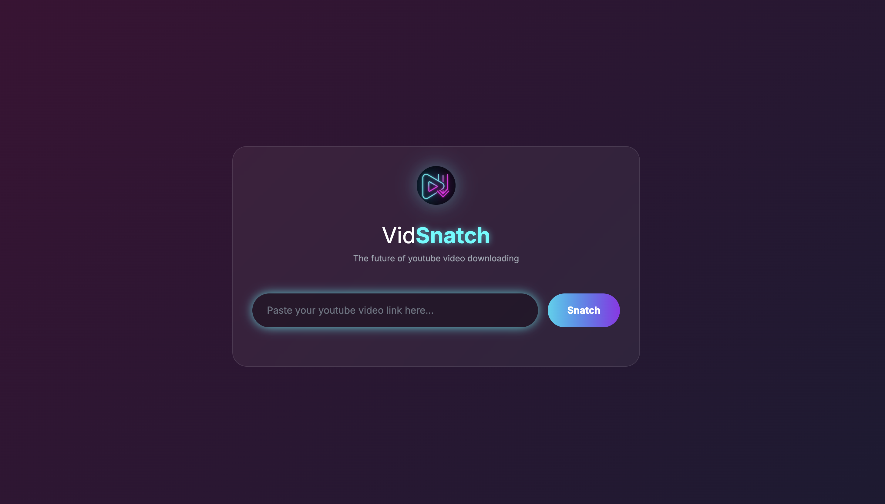

<div align="center">
  
  
  # VidSnatch 🚀
  
  *The future of YouTube video downloading*
</div>

VidSnatch is a futuristic YouTube video downloader with both a sleek web interface and powerful command-line tools. Built for the next generation with a stunning UI that appeals to Gen Z and Gen Alpha users.

## Features

- 🌟 **Futuristic Web Interface**: Beautiful glassmorphism UI with aurora background
- 📱 **Mobile-First Design**: Responsive design that works on all devices
- 🎥 **High-Quality Downloads**: Support for up to 4K video downloads with automatic audio merging
- 🎵 **Audio Extraction**: Download audio-only files as MP3
- 📝 **Transcript Download**: Extract video transcripts with timestamps
- ⚡ **Real-Time Processing**: Live video info fetching and download progress
- 💻 **Command-Line Interface**: Powerful CLI for automation and scripting
- 🚀 **Modern Tech Stack**: Built with UV, Flask, and Tailwind CSS

## Installation

Make sure you have UV installed. If not, install it first:

```bash
curl -LsSf https://astral.sh/uv/install.sh | sh
```

Then install the project dependencies:

```bash
uv sync
```

## Usage

### 🐳 Running with Docker

You can run VidSnatch using the pre-built Docker image from Docker Hub.

1.  **Pull the Docker image:**
    ```bash
    docker pull sahajamit/vidsnatch:latest
    ```

2.  **Run the Docker container:**
    ```bash
    docker run -p 8080:8080 sahajamit/vidsnatch:latest
    ```

3.  **Open your browser:**
    Navigate to `http://localhost:8080`

### 🌐 Web Interface (Recommended)

VidSnatch features a stunning futuristic web interface that's perfect for everyday use:



#### Launch the Web App

1. **Start the server:**
   ```bash
   uv run python web_app.py
   ```

2. **Open your browser:**
   Navigate to `http://localhost:8080`

3. **Start downloading:**
   - Paste any YouTube URL into the input field
   - Click "Snatch" to fetch video info
   - Select your desired video quality or transcript language
   - Click "Download Video", "Download MP3", or "Download Transcript"

The web interface features:
- **Real-time video info fetching**
- **Quality selection with visual feedback**
- **Transcript download with timestamps**
- **Fancy loading animations**
- **Automatic file downloads**
- **Mobile-responsive design**

### 💻 As a Python module

```python
from youtube_downloader import YouTubeDownloader

# Create downloader instance
downloader = YouTubeDownloader()

# Download video
downloader.download_video("https://www.youtube.com/watch?v=VIDEO_ID", output_path="./downloads")

# Download audio only
downloader.download_audio("https://www.youtube.com/watch?v=VIDEO_ID", output_path="./downloads")

# Download transcript with timestamps
downloader.download_transcript("https://www.youtube.com/watch?v=VIDEO_ID", output_path="./downloads")
```

### ⚡ Command Line Interface

VidSnatch also provides a powerful command-line interface for automation and scripting:

**Download a Video**

To download a video at the highest available resolution, run:
```bash
uv run python -m youtube_downloader --url "https://www.youtube.com/watch?v=VIDEO_ID" --type video
```

To save the video to a specific folder, use the `--output` flag:
```bash
uv run python -m youtube_downloader --url "https://www.youtube.com/watch?v=VIDEO_ID" --type video --output ./my_videos
```

**Control Video Quality**

You can control the video quality using the `--quality` flag. Here are the available options:

-   **`highest`**: Automatically selects the best available resolution. For qualities above 720p, it will download and merge separate video and audio files to provide the best quality.
-   **`lowest`**: Selects the lowest available resolution.
-   **Specific Resolutions**: You can provide a specific resolution string. Common options include:
    -   `144p`
    -   `240p`
    -   `360p`
    -   `480p`
    -   `720p`
    -   `1080p` (Full HD)
    -   `1440p` (2K)
    -   `2160p` (4K)

*Note: The availability of these resolutions depends on the original video uploaded to YouTube.*

```bash
# Download in 720p
uv run python -m youtube_downloader --url "https://www.youtube.com/watch?v=-8A1iyh1-CM" --type video --quality 720p

# Download in lowest quality
uv run python -m youtube_downloader --url "https://www.youtube.com/watch?v=-8A1iyh1-CM" --type video --quality lowest
```

**Download Audio Only**

To download only the audio from a video, use `--type audio`. The audio will be saved as an MP3 file.

```bash
uv run python -m youtube_downloader --url "https://www.youtube.com/watch?v=-8A1iyh1-CM" --type audio --quality 720p --output ./my_audio
```

**Get Video Information**

To see information about a video without downloading it, use `--type info`:
```bash
uv run python -m youtube_downloader --url "https://www.youtube.com/watch?v=VIDEO_ID" --type info
```

### Building and Publishing Docker Images

To build and push multi-platform Docker images:

1. **Create a buildx builder:**
   ```bash
   docker buildx create --name multiplatform --use
   ```

2. **Build and push for multiple platforms:**
   ```bash
   docker buildx build --platform linux/amd64,linux/arm64 -t sahajamit/vidsnatch:latest -t sahajamit/vidsnatch:0.4 --push .
   ```

3. **Build for linux/amd64 only (cloud platform compatible):**
   ```bash
   docker buildx build --platform linux/amd64 -t sahajamit/vidsnatch:latest -t sahajamit/vidsnatch:0.2 --push .
   ```

4. **Clean up Docker system (optional):**
   ```bash
   docker system prune -a
   ```

## Requirements

- Python 3.8+
- pytubefix library
- youtube-transcript-api library
- UV package manager
- ffmpeg (for audio conversion and video merging)

## License

MIT License